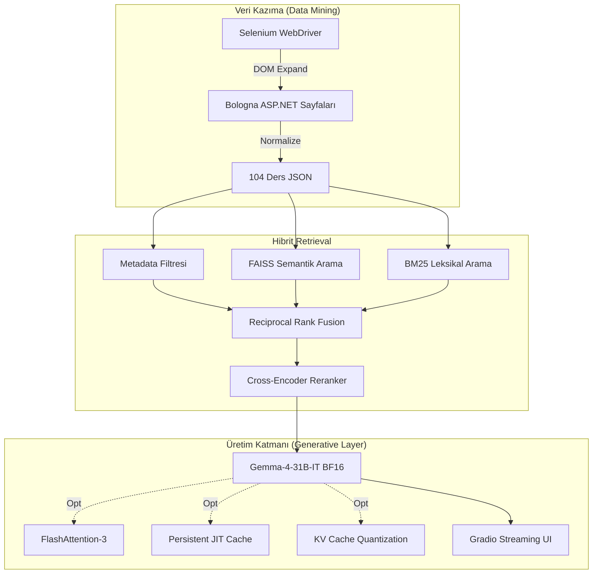

# 🎓 OBS Bologna ChatAI

**Bologna Bilgi Sistemi İçin Hibrit RAG Tabanlı Yapay Zeka Asistanı**

> Osmaniye Korkut Ata Üniversitesi — Bilgisayar Mühendisliği Bölümü  
> Mezuniyet Tezi • Haziran 2026

---

## 📌 Proje Hakkında

OBS Bologna ChatAI, üniversitelerin Bologna sürecine uygun olarak yayınladığı ders bilgi paketlerini (müfredat, AKTS, ön koşullar, ders içerikleri, değerlendirme yöntemleri vb.) yapay zeka ile sorgulanabilir hale getiren bir **RAG (Retrieval-Augmented Generation)** sistemidir.

Sistem, OKÜ Bilgisayar Mühendisliği bölümünün **104 ders bilgi paketini** kazıyarak (web scraping) veri seti oluşturur ve bu verileri **hibrit arama (BM25 + Semantik + Metadata Filtresi)** ile indeksleyerek, **Gemma-4-31B** büyük dil modeli aracılığıyla doğal dilde yanıt üretir.

### Ekip

| Üye | Rol |
|---|---|
| **Osman Küçük** | Gemma-4-31B optimizasyonu, FlashAttention-3, Hardware-Aware Loading, JIT Cache |
| **Kübra Nur Cengiz** | Gemma-4-E4B test ve değerlendirme, Hardware-Aware adaptasyon |
| **Azra Bahşi** | Gemma-4-26B-MoE test ve değerlendirme, OOM hata yönetimi |

**Danışman:** Dr. Öğr. Ü. Muhammet Talha KAKIZ

---

## 🧩 Sistem Mimarisi



---

## 🚀 Temel Özellikler

- **Hibrit RAG Pipeline:** BM25 (leksikal) + FAISS (semantik) + Metadata Filtresi → RRF Füzyonu → Cross-Encoder Reranking
- **Gemma-4-31B-IT BFloat16:** 31 milyar parametreli dense model, native BF16 hassasiyetinde çalıştırılır
- **FlashAttention-3 Monkey-Patch:** Transformers uyumsuzluğu otomatik yamalanır, dikkat mekanizması hızlandırılır
- **Persistent JIT Cache:** `torch.compile` önbelleği Google Drive'da kalıcı tutularak warm-up süresi %86 azaltılır (316 sn → 43 sn)
- **Hardware-Aware Loading:** GPU'nun Compute Capability değerine göre otomatik veri tipi seçimi (BF16/FP16)
- **OOM İzolasyonu:** ThreadWithException ile CUDA bellek taşmaları izole edilir, retry mekanizması tetiklenir
- **KV Cache Quantization:** Uzun bağlam pencerelerinde quanto ile 8-bit KV sıkıştırması
- **Akademik Metrik Paneli:** TTFT, TPS, Faithfulness, ROUGE-L otomatik raporlama

---

## 📈 Benchmark Sonuçları

| Metrik | Gemma-4-E4B | Gemma-4-26B-MoE | **Gemma-4-31B** |
|:---|:---:|:---:|:---:|
| **Mimari** | Dense (4B) | MoE (4B aktif/26B) | Dense (31B) |
| **VRAM** | 16 GB | 48 GB | ~63 GB |
| **TPS** | 9.25 | 3.07 | **9.48** |
| **Faithfulness** | 0.9477 | 0.9846 | 0.8955 |
| **ROUGE-L** | 0.5285 | 0.5139 | **0.84** |
| **Reasoning** | ❌ Zayıf | ⚠️ Orta | ✅ **Güçlü** |

**Nihai Seçim:** Gemma-4-31B-IT — Reasoning derinliği, dengeli hız-doğruluk profili ve güvenli guardrails.

---

## 📂 Proje Yapısı

```
obs-bologna-chatai/
├── main.py                  # Ana giriş noktası (Gradio UI)
├── normalize_json.py        # Bologna JSON normalleştirici
├── test_inference.py        # Benchmark ve doğrulama testleri
├── requirements.txt         # Python bağımlılıkları
├── obs_bologna_chatai-osman.ipynb  # Google Colab notebook
├── src/
│   ├── model.py             # Gemma-4-31B RAG Model yöneticisi
│   ├── vector_store.py      # Hibrit RAG (BM25 + FAISS + Metadata)
│   ├── rag_engine.py        # RAG pipeline orkestrasyonu
│   ├── metrics.py           # Akademik metrik toplayıcı
│   ├── scraper.py           # Bologna web kazıyıcı (Selenium)
│   ├── data_linter.py       # Veri kalite kontrolü
│   └── utils.py             # Yardımcı fonksiyonlar
├── data/
│   ├── normalized/          # 104 ders bilgi paketi (JSON)
│   └── summary.json         # Veri seti özeti
├── tests/                   # Unit testler
└── agents/                  # Agent konfigürasyonları
```

---

## 🛠️ Kurulum ve Çalıştırma

### Gereksinimler
- Python 3.10+
- NVIDIA GPU (A100 80GB veya GH200 önerilir)
- CUDA 12.4+

### Google Colab (Önerilen)
1. `obs_bologna_chatai-osman.ipynb` dosyasını Colab'a yükleyin
2. GPU runtime seçin (A100 veya L4)
3. HuggingFace token'ınızı Colab Secrets'a `HF_TOKEN` olarak ekleyin
4. Hücreleri sırasıyla çalıştırın

### Yerel Kurulum
```bash
git clone https://github.com/0smnkck/obs-bologna-chatai.git
cd obs-bologna-chatai

pip install -r requirements.txt

# HuggingFace token'ınızı ayarlayın
export HF_TOKEN="your_token_here"

# Sistemi başlatın
python main.py
```

---

## 📊 Benchmark Testi

```bash
# Tek sorgu testi
python test_inference.py

# Tam benchmark seti (8 farklı sorgu tipi)
python test_inference.py --benchmark
```

---

## 🔒 Güvenlik

- Kodda hiçbir hardcoded API key veya token bulunmamaktadır
- HuggingFace token'ı çevre değişkeni (`HF_TOKEN`) veya Colab Secrets üzerinden alınır
- Kişisel veriler (tez belgeleri, imzalı formlar) repo'ya dahil edilmemiştir

---

## 📄 Lisans

Bu proje Osmaniye Korkut Ata Üniversitesi Bilgisayar Mühendisliği Bölümü mezuniyet tezi kapsamında geliştirilmiştir.

---

**Osmaniye Korkut Ata Üniversitesi** • Mühendislik Fakültesi • Bilgisayar Mühendisliği Bölümü • 2026
